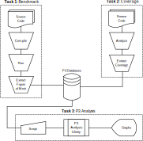

Collecting P3 Data
==================

The flowchart below shows how P3 analysis can be broken down into three tasks:

1. Collecting performance data from benchmarking.
2. Building a representation of the source code used (i.e. coverage data).
3. Using the P3 Analysis Library to compute metrics and produce graphs.

Since applications may support a wide range of platforms and compilation
options, it is recommended to store performance and coverage data in some sort
of database, to simplify the process of looking up specific results.

The P3 Analysis Library operates on data stored in pandas DataFrames, and
expects columns to have specific names. The simplest way to work with the
library is to collect and store data in a compatible format (e.g. in a CSV
file).

.. _performance_data:

Performance Data
################

Each row in the DataFrame represents an individual run of an application.

The following fields have special meaning:

- *date*: The date when the result was recorded.
- *fom*: The figure-of-merit (e.g. time to solution, throughput).
- *application*: The name of the application.
- *problem*: The name of the problem that was run.
- *platform*: The name of the platform on which the application was run.
- *coverage_key*: A unique identifier into the coverage DataFrame.

It is recommended not to store *application*, *problem* and *platform* fields
when results are initially collected, and to instead construct them using the
:py:func:`p3analysis.data.projection` function. This makes it simpler to re-use the
same data across multiple analyses using different meanings of *application*,
*problem*, and *platform*.

Fields commonly used to define an *application* include:

- The application name.
- The current git commit.
- The current git branch.
- Application-specific configuration options.

Fields commonly used to define a *problem* include:

- The problem name.
- The problem size.
- The name of an input file.

Fields commonly used to define a *platform* include:

- The hostname.
- The target architecture.
- The compiler version.

Coverage Data
#############

Each row in the DataFrame represents a collection of source code used to
compile the application associated with a set of performance records.

Coverage is described by two fields:

- *coverage_key*: A unique identifier acting as a key.
- *coverage*: A JSON string describing the source code used.

The JSON string format follows the schema `here`_, and should be considered
experimental.

.. _here:
   https://raw.githubusercontent.com/intel/p3-analysis-library/master/p3/data/coverage-0.1.0.schema
